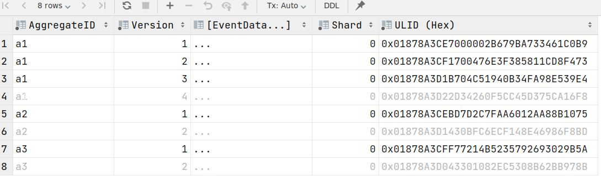

# The problem statement

The problem is to get a robust, race-safe export of events (changes)
from SQL Server. Typically, the Outbox pattern is used for this:
In the same database transaction as making the change, also write an intent
to publish an event about the change.

With this library, the "intent to publish a change" is assumed to stay around
for a longer period of time. The exact details are up to you, but the simplest
case is simply having an event sourcing table in SQL such as
```sql
create table myservice.MyEvent(
    AggregateID uniqueidentifier not null,
    Version int not null,
    primary key (AggregateID, Version),
    --  data columns
)
```
..and we wish to have a "partitioned log"/"feed" of all such events in the database,
in the order they happened; similar to Kafka, Event Hub, etc.

### Problem statement
The simple view is that polling for INSERTs in a table can be done
simply by querying for new data since last time. For instance,
if `MyTable` has an `EventID binary(16)` column, you can do:
```sql
select * from MyEvent
where EventID > @LastEventIDFromPreviousPolling  
```

The problem is that this solution is not race-safe
on its own. The problem is illustrated in the following
figure.


In this image, the solid black rows have been committed and are visible
to readers. The grayed out rows (4, 6, and 8) are in *pending* transactions,
not yet committed, and are only visible to the transactions writing them.

If a reader now reads the table, it will see the 7th row as the last
one and note down `ULID = 0x...B5A` as its cursor position in the table,
*without* having read the 4th and 6th row -- thus never consuming this data.

The problem is that any kind of sequential identifier
being generated and written inside a database transaction can cause a race where the
reader skips some changes. See the illustration below;
in the image "SeqNum" is a generated ID (e.g. `identity` ID),
but e.g. timestamps have the same problem.

The following illustration is a visual illustration
of the same problem:


## Other alternatives

This lists some alternatives for exporting events:

* Anything based on timestamp or IDs / identity columns: Not safe
  against readers racing active transactions, as described above.

* CDC: High latency (order of 20+ seconds); in particular on Azure
  SQL we have not found a way to tune the cronjob to run with a
  frequency of sub-second

* changetable: Works well if you are on the "head" of events, but if
  you fall behind it takes a long time to fetch a page of events, and
  reading all events ends up being O(N^2) due to some missing indexes internally
  in SQL. Even if these problems were fixed, there is a lack of manual
  control (e.g., you want to somehow update a row, without "re-publishing"
  it, due to misc. data migrations)

* rowversion cast to integer combined with `min_active_rowversion()`:
  Does the job, but if an active transaction that writes to a table
  with a rowversion column stays active for a long time (e.g. severed
  connection inside transaction) you can block event export for a
  veery long time (30 seconds+)

* Outbox pattern: Inflexible, you can only have one target/action of
  your change which couples the business logic tables with a single
  event export mechanism.

The solution in this repo has none of these problems.