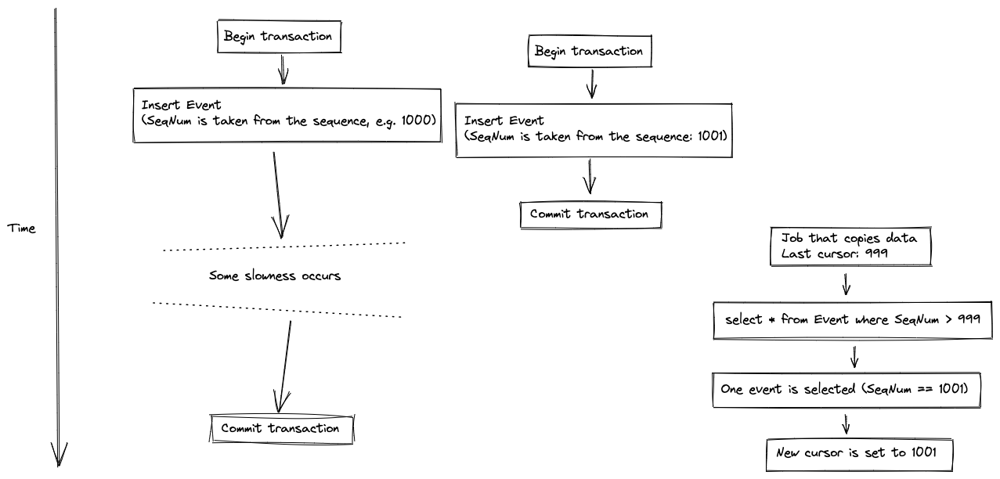

# The problem statement

The problem is to get a robust, race-safe export of events (changes)
from SQL Server. The problem is that any kind of sequential identifier
being generated and written inside a database transaction can cause a race where the
reader skips some changes. See the illustration below;
in the image "SeqNum" is a generated ID (e.g. `identity` ID),
but e.g. timestamps have the same problem.

This lists some alternatives for exporting events:

* Anything based on timestamp or IDs / identity columns: Not safe
  against readers racing active transactions, as described above.

* CDC: High latency (order of several seconds); in particular on Azure
  SQL we have not found a way to tune the cronjob to run with a
  frequency of sub-second

* changetable: Works well if you are on the "head" of events, but if
  you fall behind it takes a long time to fetch a page of events, and
  reading all events ends up being O(N^2)

* rowversion cast to integer combined with `min_active_rowversion()`:
  Does the job, but if an active transaction that writes to a table
  with a rowversion column stays active for a long time (e.g. severed
  connection inside transaction) you can block event export for a
  veery long time (30 seconds+)

* Postbox pattern: Inflexible, you can only have one target/action of
  your change which couples the business logic tables with a single
  event export mechanism.

The solution in this repo has none of these problems. It does have a couple of
disadvantages that must be weighed against the solutions above:

* Home-grown

* Need to run a dedicated background process (as Docker image or
  inside your own service) to assign change sequence numbers. (This
  isn't all that different from what Microsoft is doing with the CDC job.)
